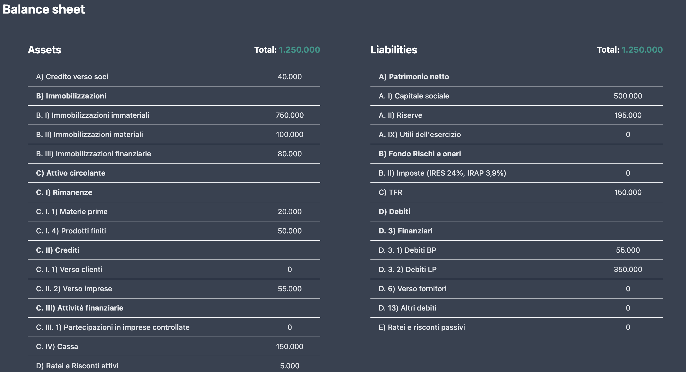
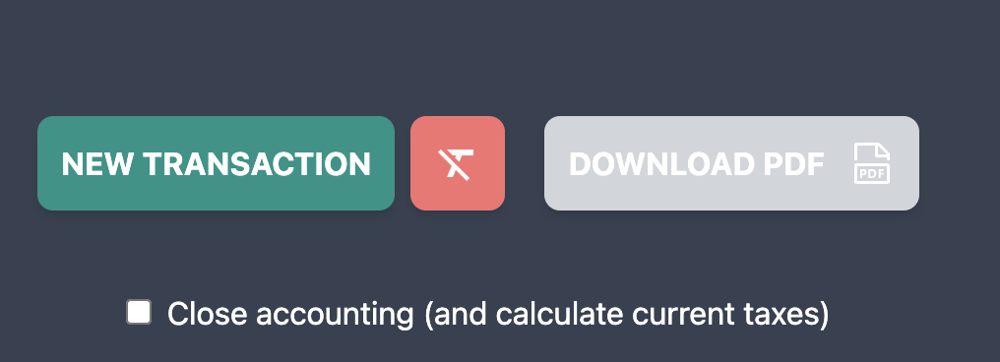

# Financial Report Online ⚖️

An open source project to create your own company financial report by entering all the necessary items. You can also save it as a PDF document. 

&#8594; Dark mode and white mode supported! 🌚

Developed for Economics and Business Organization exam @ UniBg - Computer Engineering.

## Balance sheet

_All items of the balance sheet with the total amount._

## Income statement

_All items of the income statement with the total amount._

## Actions available

<em>
You can:

- Create a new transaction (insert new data)
- Clear your new data (saved on localStorage)
- Download PDF of the financial report once the accounting year has been closed
- Close the accounting year (and calculate current taxes)
  </em>

## Insert operation function

*You can use pre-built operations (pay salaries, buy materials, selling products, ...) with their value or create your custom operations by specifying the individual categories to move (knowledge of double-entry bookkeeping is required for this).*
